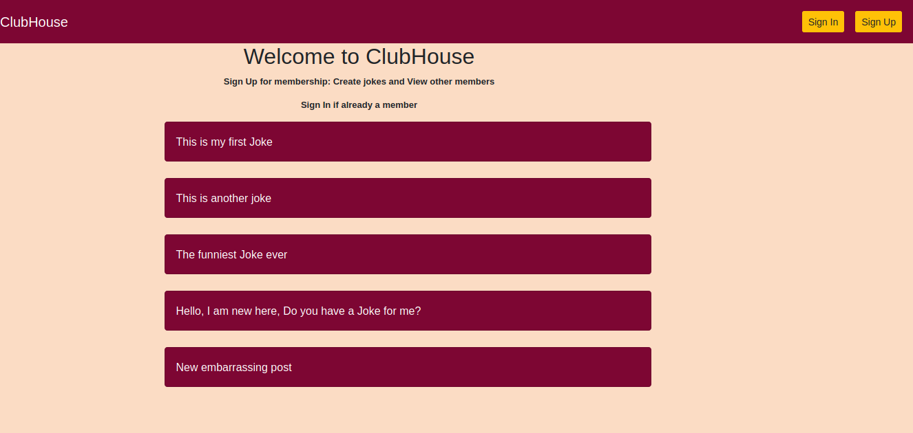

# Members Only

## Description
In this project, we building an exclusive clubhouse where your members can write embarrassing posts about non-members. Inside the clubhouse, members can see who the author of a post is but, outside, they can only see the story and wonder who wrote it.



## Built With
- Major languages: Ruby 2.7.0
- css: for form styling
- bootstrap 4
- frameworks: Rails 5.2.3
- technologies used: Rubocop

### Prerequisites
ruby version 2.7.0
rails version 5.2.3

### Setup
1. Clone the project
```console
git clone https://github.com/eduardoreisalvarenga/club-house.git
```
2. Go to the project folder
```console
cd club-house
```
3. Check out the working branch
```console
git checkout feature_one
```
4. run bundle to install all gems
```console 
bundle install
```
5. Update local database
```console
rails db:migrate
```

### Usage
Run the following command to run the project
```console
rails s
```  
6. Open your browser and type: http://localhost:3000/

## Authors

👤 **Eduardo**

- Github: [@githubhandle](https://github.com/eduardoreisalvarenga)
- Twitter: [@twitterhandle](https://twitter.com/eduardodosrei11)
- Linkedin: [linkedin](https://www.linkedin.com/in/eduardo-alvarenga-44204818a/)


👤 **Oloo Moses**

- Github: [@githubhandle](https://github.com/oloomoses) 
- Twitter: [@twitterhandle](https://twitter.com/olooine)
- Linkedin: [linkedin](https://www.linkedin.com/in/oloo-moses-528bb1b3/)

## Show your support

Give a ⭐️ if you like this project!

## Acknowledgments

- Hat tip to anyone whose code was used
- Inspiration
- etc

## 📝 License

This project is [MIT](lic.url) licensed.
